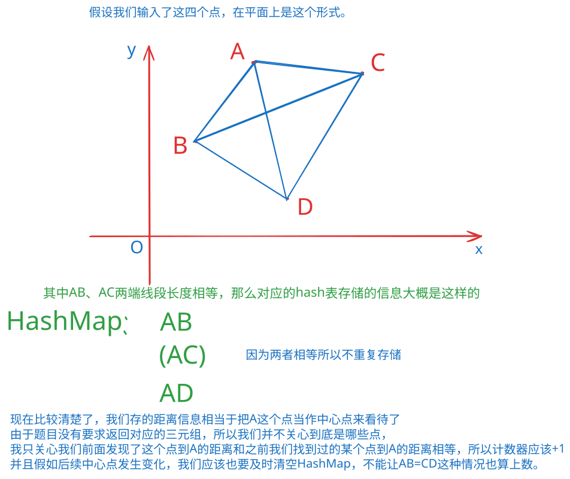

# 二维平面等距三元组计数

**难度**：**Medium **

**标签**：`array`  `hash-table` `Enumeration`

**日期**：2026/09/17


### 题目描述

给定平面上的 n 个点，每个点由坐标 (x,y) 表示。

从这些点中选择三个不同的点，其中一个点作为中间点，另外两个点作为端点。如果两个端点到中间点的距离相等，则称这三个点构成一个符合条件的三元组。

设三个点分别为 A、B、C，其中 B 为中间点，需要满足：

$dist⁡(A,B)=dist⁡(B,C)$
需要注意的是，不同的点顺序需要分别计数。例如，(A,B,C) 和 (C,B,A) 应计为两个不同的三元组。

请统计符合条件的三元组总数。

本题采用ACM模式，需自行处理输入与输出。

### 我的思路

​	首先最直接简单粗暴的办法就是用三个for循环来处理这个问题，遍历三次数组，看差值，只要满足就计数。这也是最简单的思路。但是这种方法它的时间复杂度是$O(N^3)$，是我们完全无法接受的时间复杂度，也一定会导致超时问题。

​	那么我们来思考有什么办法减少遍历的次数呢，首先既然顺序不同也会计数，那么我们如果不计数只是顺序不同的三元组呢？只要能少遍历这几种可能性，那么就能降低运行次数。既然只是顺序不同，那就代表着三元组的三个点都出现过的。既然如此，就变成了检查三元组三个节点是否都出现过就可以了。我们之前学习的**哈希表**，现在就可以用上了。

​	现在我们知道了要用哈希表来解决问题，我们也知道哈希表只能存储Key和Value，并不足够同时存储三个点的信息，因此我们不能直接存储我们之前见过哪些点，而且就算我们知道了之前见过了哪些点，具体的距离仍然是需要重新计算的，这并不能降低复杂度。所以哈希表一定不是单纯的存放点的下标信息的。

​	那么我们还能存放些什么呢？

​	反正我们不管怎么样，都要算两点之间的距离，不如存放一下距离试试看。既然是存放距离，利用哈希表查找仅$O(1)$时间复杂度的特性，我们不如就存我们之前没遇到过的距离吧。让我们画个图来整理一下思路。

​	

​	既然如此那么一切都清楚了，利用两个for循环，外层的for循环代表中心点，里侧的for循环代表我们正在寻找的两个点，如果在哈希表里面存在重复的距离，就给计数器*count*+1。

​	我们高中就学习过欧几里得距离公式，也叫**两点间距离公式**：

​													$dist(A,B)=\sqrt{(x_A-x_B)^2+(y_A-y_B)^2}$

​	这个计算量有点小复杂，我们要不要试试在其他寻路算法里面很常用的**曼哈顿距离（Manhattan distance）**来简化一下计算呢？

​														$d_{manhattan}=|x_A-x_B|+|y_A-y_B|$

​	假设中心点是$B = (0, 0)$、另外两点是$A = (2, 0)$、$C = (1, 1)$，他们的曼哈顿距离$d_{manhattan}(B,A)=2、$$d_{manhattan}(B,C)=1+1=2$ 但是两者的欧几里得距离是$dist(B,A)=2$ 、$dist(B,C)=\sqrt{2}$并不相等，所以并不能用曼哈顿距离取代欧几里得距离。

​	现在距离也知道怎么算了，算法大致雏形也出来了，下面正确思路板块里我来讲讲问题在哪。

### 正确思路

​	前面我的思路整体而言是正确的，但是在针对计数器的处理上，存在一些小瑕疵。我进入了一个误区就是最终三元组的总数是两倍的count就得出答案了，但是这其实是错误的。

​	事实上，我们所得到的只是线段相等的数量，而且很混乱。如果我们有$A,B,C,D,E,F$六个点，我们假设其中

​	$AB=1$、	$AC=1$、	$AD=$、2	$AE=2$、$AF=1$、这种情况下，我们正确的计数方式应该是$A_3^2+A_2^2=8$、如果只是用一个全局的count变量以及原本的方法来看，我们得出的答案是$3*2=6$ ，是错误的。这也一定程度上解释了为什么侥幸通过了部分用例，因为对某些情况来讲*2是可以巧合的得出正确答案的。

​	既然如此，我们就要改进哈希表的存储，给Value重新赋值，不再是原本单纯的赋值一个无意义的数字，而是赋值针对已经出现过的距离的重复次数。最后的答案再根据哈希表存放的数值进行排序数运算就可以得出正确答案了。

​	特别的，正解代码为了预防int的溢出问题，因此改用long来计算距离。

### 正解代码

```Java
import java.util.*;

public class Main {
    public static void main(String[] args) {
        //处理输入
        Scanner in = new Scanner(System.in);
        int n = in.nextInt();
        int[][] point = new int[n][2];

        for (int i = 0; i < n; i++) {
            point[i][0] = in.nextInt();
            point[i][1] = in.nextInt();
        }
        
		//正解算法
        long answer = 0;

        for (int i = 0; i < n; i++) {
            Map<Long, Integer> distanceCount = new HashMap<>();

            for (int j = 0; j < n; j++) {
                if (i == j) {
                    continue;
                }

                long dx = (long) point[j][0] - point[i][0];
                long dy = (long) point[j][1] - point[i][1];
                long distance = dx * dx + dy * dy;

                int previous = distanceCount.getOrDefault(distance, 0);

                // 当前点和之前的 previous 个同距离点配对，
                // 两个端点交换顺序也算不同
                answer += 2L * previous;
                distanceCount.put(distance, previous + 1);
            }
        }
        System.out.println(answer);
    }
}
```


## 复杂度分析

**我的思路**：时间复杂度：$O(N^2)$、空间复杂度：$O(N)$

**正解**：时间复杂度：**$O(N^2)$**、空间复杂度：**$O(N)$**

## 总结

本题类似于LeetCode 2367题.等差三元组的数目，只是从原本的一维升级到了二维平面，并且需要考虑顺序问题。错误原因主要在于最终计数器的处理不当，有考虑排序数，但是未能清晰的分析并解决问题。
